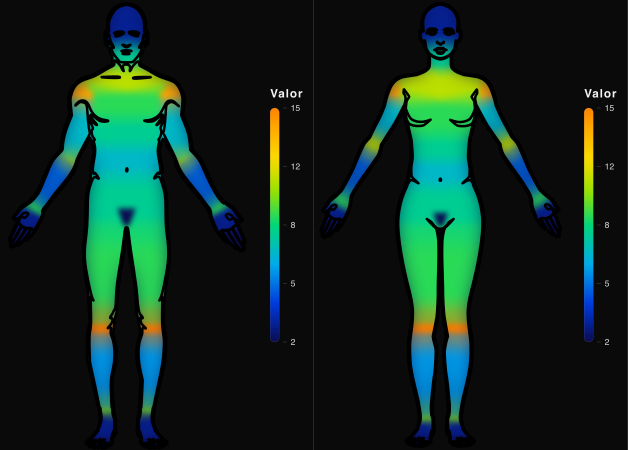
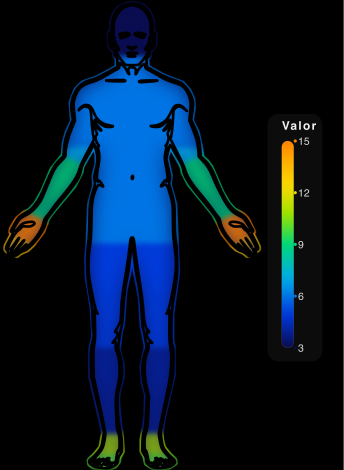
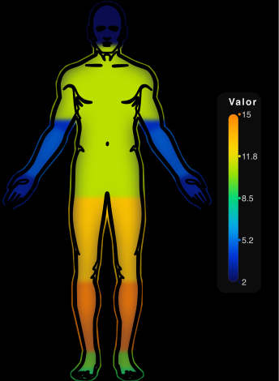
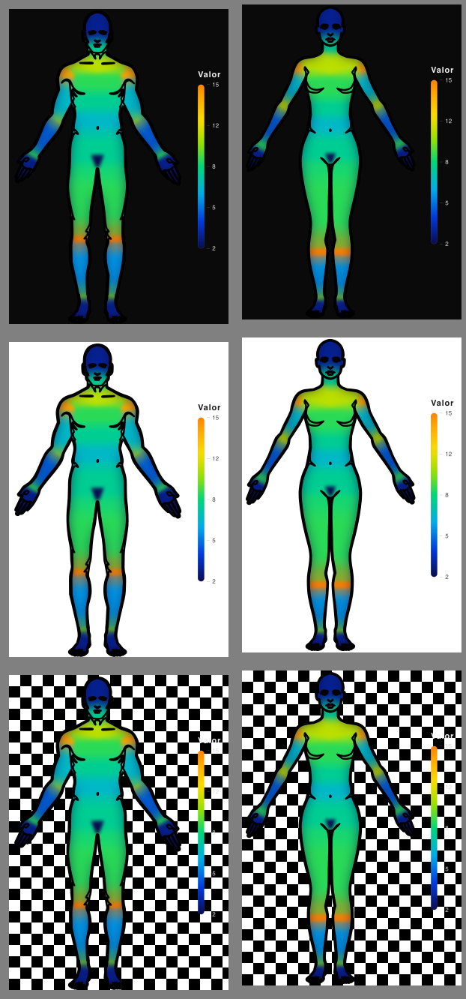
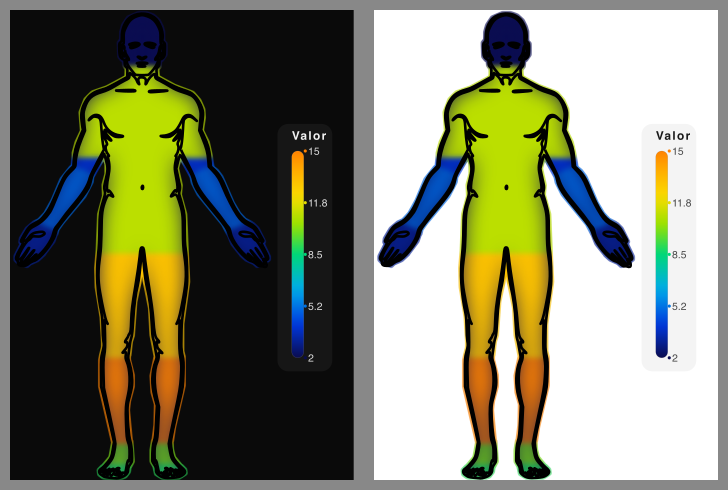
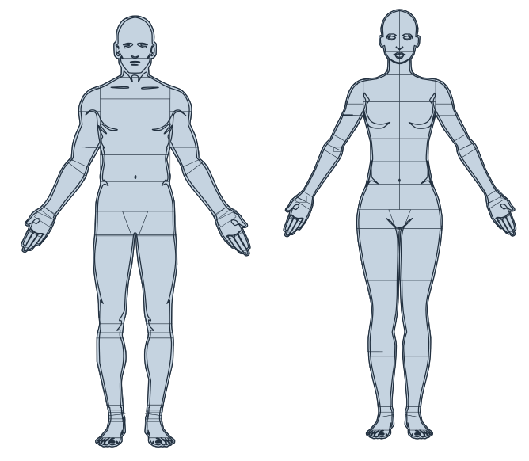

<p align="center">
  
</p>

<h1 align="center">anatomapa</h1>

<p align="center">
  <strong>Pinte o corpo humano com os seus dados.</strong><br/>
  De um dicionário ou de uma planilha a um mapa de calor anatômico em SVG, pronto pra publicar,
  em poucas linhas de Python e com zero dependências.
</p>

<p align="center">
  <a href="README.md"> <strong>Português</strong></a>
  &nbsp;·&nbsp;
  <a href="README.en.md"> English</a>
</p>

<p align="center">
  
  
  
</p>

<p align="center">
  
</p>

<br>

## Sobre

**anatomapa** é uma biblioteca Python para gerar **mapas de calor anatômicos** da superfície
externa do corpo humano. Você entrega dados quantitativos por região (frequência, intensidade
ou densidade de eventos) e a lib devolve um SVG com o corpo colorido, na vista anterior ou
posterior, masculino ou feminino, com a cor proporcional ao valor de cada região.

Serve pra qualquer área que registra a região corporal como variável: acidentes com animais
peçonhentos (escorpiões, serpentes, aranhas), traumas ocupacionais, lesões esportivas,
medicina forense, queimaduras e dermatologia.

- **Zero dependências:** só a stdlib do Python. Sem matplotlib, pandas, numpy ou pillow.
- **Determinística:** a mesma entrada gera exatamente o mesmo SVG.
- **Bilíngue:** entende nomes de região em PT-BR e EN e escreve rótulos nos dois idiomas.

## Instalação

Ainda não está no PyPI. Por enquanto, clone o repositório:

```bash
git clone https://github.com/pedrorcruzz/anatomapa.git
cd anatomapa
```

Requer **Python 3.10+**. Nenhuma dependência externa.

## Início rápido

```python
import anatomapa as am

fig = am.heatmap({"MÃO": 5153, "PÉ": 13666, "cabeça": 845})
fig.save("mapa.svg")
```

Pronto: um SVG com mãos, pés e cabeça coloridos por valor. Tudo o mais é opcional, e é o que
o resto deste manual cobre.

## Parâmetros de `heatmap()`

```python
am.heatmap(values, view="anterior", body="male", cmap="reds", scale="linear", lang="pt",
           title=None, smooth=False, legend=False, background="transparent",
           on_unknown="error", missing="neutral", region_map=None, assets_dir=None)
```

| Parâmetro    | Valores                                                        | Padrão          | O que faz |
|--------------|----------------------------------------------------------------|-----------------|-----------|
| `values`     | `dict {região: valor}` ou pares `(região, valor)`              | obrigatório     | Dados; aceita a saída dos leitores direto |
| `view`       | `"anterior"`, `"posterior"`                                    | `"anterior"`    | Vista do corpo (frente ou costas) |
| `body`       | `"male"`, `"female"`                                           | `"male"`        | Corpo masculino ou feminino |
| `cmap`       | `"reds"`, `"heat"`, `"viridis"`, `"blues"`, `"greens"`, `"thermal"` | `"reds"`   | Paleta de cores |
| `scale`      | `"linear"`, `"log"`                                            | `"linear"`      | Como valores viram intensidade |
| `lang`       | `"pt"`, `"en"`                                                 | `"pt"`          | Idioma dos rótulos escritos no SVG |
| `title`      | `str` ou `None`                                                | `None`          | Título desenhado na figura |
| `smooth`     | `bool`                                                         | `False`         | Degradê térmico contínuo em vez de cor chapada |
| `legend`     | `bool`                                                         | `False`         | Barra de valores (mín..máx) ao lado |
| `background` | `"dark"`, `"light"`, `"transparent"`                           | `"transparent"` | Fundo da figura |
| `on_unknown` | `"error"`, `"skip"`, `"warn"`                                  | `"error"`       | O que fazer com nome não reconhecido |
| `missing`    | `"neutral"`, `"cold"`                                          | `"neutral"`     | Cor da região sem dado |
| `region_map` | `dict {seu rótulo: id da região}`                              | `None`          | De-para de nomes seus; tem precedência |
| `assets_dir` | `str` ou `None`                                                | `None`          | Caminho alternativo dos assets |

Retorna um objeto [`Figure`](#saída-o-objeto-figure). Nome de região desconhecido levanta
`ResolutionError` (exceção pública da lib).

## Paletas (`cmap`)

| Paleta    | Visual | Quando usar |
|-----------|--------|-------------|
| `reds`    | claro para vermelho (padrão) | relatórios sóbrios, impressão |
| `heat`    | amarelo para vermelho | destaque de "zonas quentes" clássico |
| `viridis` | roxo para amarelo | percepção uniforme, amigável a daltonismo |
| `blues`   | claro para azul | dados "frios" (umidade, exposição) |
| `greens`  | claro para verde | indicadores positivos |
| `thermal` | azul frio para laranja quente, topo laranja | visual de câmera térmica; combina com `background="dark"` |

## Escalas (`scale`)

- **`"linear"`** (padrão): a cor cresce proporcional ao valor. Boa pra dados equilibrados.
- **`"log"`**: comprime valores extremos. Use quando os dados são muito assimétricos (caso
  típico de frequência de acidentes, em que uma região concentra quase tudo):

```python
am.heatmap({"pé": 13666, "cabeça": 845}, scale="log")  # a cabeça ainda aparece
```

## Vistas e corpos

`view` aceita `"anterior"` (frente) e `"posterior"` (costas). Não existe `"both"`: pra ter as
duas vistas, chame `heatmap()` duas vezes.

```python
frente = am.heatmap(dados, view="anterior", body="female")
costas = am.heatmap(dados, view="posterior", body="female")
frente.save("frente.svg"); costas.save("costas.svg")
```

## Fundo, legenda e suavização

- **`background`**: `"dark"` (#0a0a0a), `"light"` (#ffffff) ou `"transparent"` (padrão, sem
  fundo). As cores da legenda se adaptam ao fundo escolhido.
- **`legend=True`**: desenha uma pílula com a barra de valores ao lado do corpo, de mín a máx,
  com o rótulo no idioma de `lang` ("Valor" ou "Value").
- **`smooth`**: com `False` (padrão), cada região sai com **cor chapada**, boa pra leitura
  categórica. Com `True`, a lib gera um **degradê térmico contínuo** sobre o corpo (modelo
  preservado, rim frio e contorno nítido), com cara de imagem térmica de verdade:

```python
am.heatmap(dados, cmap="thermal", smooth=True, legend=True, background="dark")
```

## Nomes de região

O resolvedor é tolerante de propósito. Ele aceita:

| Você escreve                             | Vira   |
|------------------------------------------|--------|
| `"MÃO"`, `"mao"`, `"mãos"`, `"hand"`, `"punho"` | `hand` |
| `"Dedo da mão"`, `"finger"`, `"dedos"`   | `finger` |
| `"tronco"`, `"trunk"`, `"torso"`         | `trunk` |

Ou seja: **PT ou EN**, maiúsc/minúsc, com ou sem acento, plural e sinônimos. O que ele **não**
faz é chutar: nome desconhecido levanta `ResolutionError` listando todos os nomes ruins com
sugestões do mais parecido. Controle com `on_unknown`: `"error"` (padrão), `"skip"` (ignora em
silêncio) ou `"warn"` (ignora avisando).

**Lateralidade.** Regiões bilaterais (braço, antebraço, mão, dedo, coxa, perna, pé, dedo do pé)
aceitam lado: `"mão direita"`, `"right hand"` ou o id `"hand_right"` pintam só a mão direita.
Sem lado, o valor pinta os dois lados.

```python
am.heatmap({"mão direita": 500, "mão esquerda": 20, "perna direita": 80})
```

**Seus próprios nomes.** Se a planilha usa códigos internos, mapeie com `region_map`
(aceita ids lateralizados e tem precedência sobre o resolvedor):

```python
am.heatmap(dados, region_map={"Membro Sup Dir": "arm", "right_hand": "hand_right"})
```

## Regiões e hierarquia

São **14 regiões**. `trunk` é um **agregador hierárquico**: não tem geometria própria, só
distribui valor para os filhos. Bilaterais recebem um valor pros dois lados (ou lado explícito).

| id        | PT-BR      | Vista            | Bilateral | Pai     |
|-----------|------------|------------------|-----------|---------|
| `head`    | Cabeça     | ambas            | não       |         |
| `trunk`   | Tronco     | agregador        | não       |         |
| `chest`   | Peito      | só frente        | não       | `trunk` |
| `abdomen` | Abdômen    | só frente        | não       | `trunk` |
| `pelvis`  | Pelve      | frente e costas  | não       | `trunk` |
| `back`    | Costas     | só costas        | não       | `trunk` |
| `arm`     | Braço      | ambas            | sim       |         |
| `forearm` | Antebraço  | ambas            | sim       |         |
| `hand`    | Mão        | ambas            | sim       |         |
| `finger`  | Dedo       | ambas            | sim       | `hand`  |
| `thigh`   | Coxa       | ambas            | sim       |         |
| `leg`     | Perna      | ambas            | sim       |         |
| `foot`    | Pé         | ambas            | sim       |         |
| `toe`     | Dedo do pé | ambas            | sim       | `foot`  |

**Rollup (herança pai para filhos).** Mande o dado no nível que você tiver:

```python
am.heatmap({"tronco": 2602})                            # peito+abdômen+pelve+costas herdam
am.heatmap({"peito": 900, "abdômen": 1200, "pelve": 500})  # ou por parte
```

Um valor no pai desce automaticamente pros filhos; se você informar a parte específica, ela
usa o próprio valor. Mesma lógica em `mão` para `dedo` e `pé` para `dedo do pé`.

**Região sem dado (`missing`).** Com `"neutral"` (padrão), região sem valor sai em **cinza
neutro** (#9aa0a6), distinto do frio: "sem dado" não se confunde com "poucos casos". Com
`"cold"`, sem dado vira cor fria e o corpo inteiro fica colorido (visual câmera térmica).

## Entrada de dados

`heatmap()` aceita `dict` ou qualquer iterável de pares `(região, valor)`, então a saída de
todos os leitores vai direto, sem conversão:

```python
# dict puro (ou normalizado via from_dict)
fig = am.heatmap(am.from_dict({"mão": 10, "pé": 25}))

# CSV: você declara as colunas, nada é adivinhado
dados = am.from_csv("lesoes.csv", region_col="regiao", value_col="total", delimiter=",")

# JSON: objeto {"mão": 10} ou lista [{"region": "...", "value": ...}]
dados = am.from_json("lesoes.json", region_key="region", value_key="value")

# Registros: dicts, namedtuples, dataclasses e DataFrame do pandas (duck typing)
dados = am.from_records(registros, region_col="regiao", value_col="total")

# Excel .xlsx, sem dependência externa; coluna por índice, letra "D" ou nome do cabeçalho
dados = am.from_xlsx("lesoes.xlsx", sheet="2024", region_col="Região",
                     value_col="Total", header=True)
```

No `from_xlsx`, `aggregate` resolve planilhas com uma linha por caso: `"count"` conta as
ocorrências de cada região e `"sum"` soma os valores. `None` (padrão) espera uma linha por região.

## Saída: o objeto `Figure`

| Uso              | Resultado |
|------------------|-----------|
| `fig.save("mapa.svg")` | grava o arquivo SVG |
| `fig.to_svg()`   | devolve o SVG como `str` |
| `str(fig)`       | idem, SVG puro (útil em templates) |
| célula do Jupyter | renderiza inline automaticamente |

## Exemplo completo

Topografia de picadas de escorpião (frequência por região), do dado bruto ao mapa final:

```python
import anatomapa as am

dados = {"cabeça": 845, "braço": 1831, "antebraço": 974, "mão": 5153,
         "dedo da mão": 8684, "tronco": 2602, "coxa": 1733, "perna": 1984,
         "pé": 13666, "dedo do pé": 6547}

# 1. Confere os nomes antes de renderizar (dry-run, não gera nada)
resultado = am.validate(dados)
assert not resultado["unresolved"]

# 2. Gera o mapa: escala log (dados assimétricos), visual térmico em fundo escuro
fig = am.heatmap(dados, view="anterior", body="male", cmap="thermal",
                 scale="log", smooth=True, legend=True, background="dark")
fig.save("mapa.svg")
```

## Utilidades

**`validate(values, view="anterior", body="male", region_map=None, assets_dir=None)`**
faz o dry-run: não renderiza, só mostra o que resolve e o que não.

```python
am.validate({"mao": 1, "pedro": 2, "mão direita": 3})
# {'resolved': {'mao': 'hand', 'mão direita': 'hand_right'},
#  'unresolved': {'pedro': {'reason': '...', 'suggestions': ['dedo', ...]}}}
```

**`list_regions(view="anterior", lang="pt", body="male", assets_dir=None)`** lista as regiões
da vista, cada uma como `{"id", "label", "bilateral", "parent"}`:

```python
am.list_regions(view="posterior", lang="pt")
# [{'id': 'head', 'label': 'Cabeça', 'bilateral': False, 'parent': None}, ...]
```

## Galeria

<p align="center">
  
  &nbsp;
  
</p>

<p align="center">
  
</p>

<p align="center">
  
</p>

<p align="center">
  
</p>

## Licença e atribuição

Distribuído sob a licença **MIT**. Veja o arquivo [LICENSE](LICENSE).

As silhuetas dos modelos SVG derivam de fonte em **domínio público (CC0)**; detalhes em
[`app/anatomapa/assets/ATTRIBUTION.txt`](app/anatomapa/assets/ATTRIBUTION.txt).

## Créditos

- **Pedro Rosa**: programador/criador
- **Marcelo Reis**: Professor do Programa de Pós-Graduação em Análise de Sistemas Ambientais, CESMAC
- **Mozart Melo**: coordenador/orientador, CESMAC
- **Centro Universitário CESMAC**: instituição

<br>

<p align="center">
  ⭐ <strong>Se o anatomapa te ajudou, deixa uma estrela no repositório!</strong> ⭐
</p>
